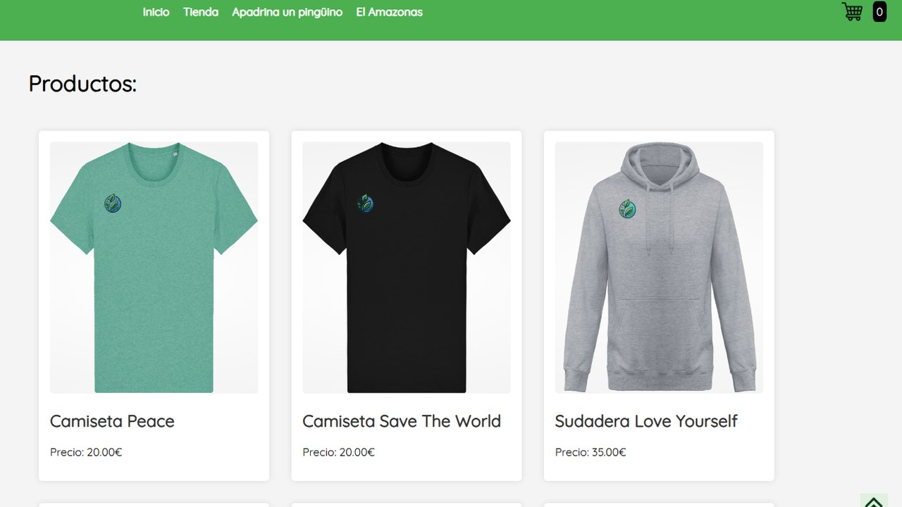

# EcoClothes — E-commerce

Tienda online de ropa sostenible hecha desde cero con HTML, CSS y JavaScript, sin frameworks.

## Qué hace

- Página de inicio con vídeo de fondo, productos destacados y reseñas de clientes.
- Catálogo con una ficha por producto.
- Carrito de la compra y proceso de pago hasta la confirmación del pedido.

## Cómo ejecutarlo

Es un sitio estático: abre `inicio.html` en el navegador.

## Contenido

| Fichero | Qué es |
|---|---|
| `inicio.html` | Página principal |
| `ropa.html` | Catálogo |
| `ProductosWebs/` | Ficha de cada producto |
| `carrito.js, pagar.html, pedido.html` | Carrito, pago y confirmación |
| `memoria_proyecto.pdf` | Memoria del proyecto |
| `enunciado.pdf` | Especificación del proyecto |

---

Proyecto final en equipo de la asignatura Tecnologías Web, Grado en Tecnología Digital y Multimedia (UPV). Forma parte de mi [portfolio](https://quique-such.github.io/portafolio/).
